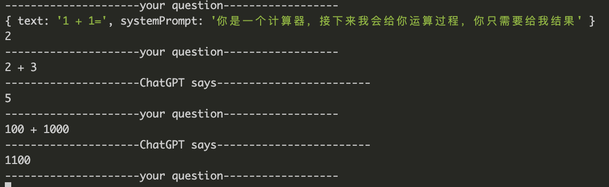

<div align="center">

</a>
</div>
<h1 align="center">ChatGPT-API</h1>

This is a more universal open-source library for the ChatGPT API that supports the CommonJS module system. Your Node.js version only needs to be above **v12**(The lower versions have not been tested yet) to use it. In general, it's a fairly universal ChatGPT API library that invokes the official ChatGPT HTTP interface directly.

- Supports **CommonJS**
- Supports **NodeJS V12+**
- The network requests are made using axios and support **proxy**

> The original intention of the project was to address the lack of support for CommonJS among existing open-source libraries, which made it challenging to integrate them into older projects. Additionally, OpenAI has recently banned certain IP addresses, so I need proxy support when making requests.

In addition, this library plans to support most of OpenAI's open HTTP interfaces to better utilize the services provided by OpenAI. For specific documentation, please refer to [API REFERENCE](https://platform.openai.com/docs/api-reference/models/list).

As you may often encounter poor ChatGPT website experience, using API interface to ask questions in the future may become more efficient.

## install

Just run

```bash
npm i @lxfriday/chatgpt

# or
yarn add @lxfriday/chatgpt

# or
pnpm i @lxfriday/chatgpt
```

## usage

The First Example:


```ts
// app.ts
import { ChatGPT } from '@lxfriday/chatgpt'

const api = new ChatGPT({
  apiKey: 'your api key', // get api key https://platform.openai.com/account/api-keys
})
async function run() {
  const res = await api.sendMessage({
    text: 'please introduce yourself',
  })
  console.log(res)
}
run()

// res {
//   success: true,
//   data: {
//     id: '753d6d2a-4352-423c-9ced-cec17e1acd64',
//     text: '不吃早餐可能会导致身体出现一些不良反应，例如头昏、乏力、注意力不集中等。此外，长期不吃早餐还可能增加患肥胖症和糖尿病的风险。因此，建议每天都要吃早餐，以保持身体健康。',
//     created: 1681634136,
//     role: 'assistant',
//     parentMessageId: '96d050ce-b53c-4357-a5bd-188008adf194',
//     tokens: 172,
//     len: 211
//   },
//   status: 200
// }
```

You can get API key at [https://platform.openai.com/account/api-keys](https://platform.openai.com/account/api-keys).

or response with stream:

```typescript
import apiKey from './.key'
import { ChatGPT } from '../src'

const api = new ChatGPT({
  apiKey: apiKey, // get api key
})

async function run() {
  const res = await api.sendMessage({
    text: 'calc 1 + 2',
    model: 'gpt-3.5-turbo',
    onProgress(t) {
      console.log('[onProgress]', t)
    },
    onEnd(t) {
      console.log('[onEnd]', t)
    },
  })
  console.log('res', res)
}

run()

// [onProgress] 3
// [onProgress]
// [onEnd] {
//   success: true,
//   data: {
//     id: '14cb9244-a1bf-4152-8aba-1ee768fcc210',
//     text: '3',
//     created: 1681634268,
//     role: 'assistant',
//     parentMessageId: 'ae4f6881-0c54-4484-862c-2d31d8d394e3',
//     tokens: 40,
//     len: 127
//   },
//   status: 200
// }
// res {
//   success: true,
//   data: {
//     id: '14cb9244-a1bf-4152-8aba-1ee768fcc210',
//     text: '3',
//     created: 1681634268,
//     role: 'assistant',
//     parentMessageId: 'ae4f6881-0c54-4484-862c-2d31d8d394e3',
//     tokens: 40,
//     len: 127
//   },
//   status: 200
// }
```

or use it in terminal:



```typescript
import { getReadLine } from '../src/utils'
import { ChatGPT } from '../src'
import { IChatGPTResponse } from '../src/types'
import apiKey from './.key'

const api = new ChatGPT({
  apiKey,
})

void (async function () {
  console.log('---------------------your question------------------')
  console.log({
    text: '1 + 1=',
    systemPrompt: '你是一个计算器，接下来我会给你运算过程，你只需要给我结果',
  })
  let prevRes = await api.sendMessage({
    text: '1 + 1=',
    systemPrompt: '你是一个计算器，接下来我会给你运算过程，你只需要给我结果',
  })
  console.log(prevRes && (prevRes.data as IChatGPTResponse).text)
  let line = ''
  const readline = getReadLine()
  console.log('---------------------your question------------------')
  while ((line = await readline())) {
    prevRes = await basicRunner(
      line,
      prevRes ? (prevRes.data as IChatGPTResponse).id : undefined,
    )
    console.log('---------------------ChatGPT says------------------------')
    console.log(prevRes && (prevRes.data as IChatGPTResponse).text)
    console.log('---------------------your question------------------')
  }
})()

async function basicRunner(text: string, parentMessageId?: string) {
  const res = await api.sendMessage({
    text,
    parentMessageId,
  })
  return res
}
```

**Note that there is a history of conversations stored within the SDK. When asking a question, the context from previous conversations will be used to continue the response.**

## Azure OpenAI Service

```typescript
import { ChatGPT } from '../src'

const api = new ChatGPT({
  apiKey: process.env.AZURE_OPENAI_API_KEY as string, // get api key
  AZURE: {
    createChatCompletion:
      'https://gptdemo1.openai.azure.com/openai/deployments/deploy1/chat/completions?api-version=2023-03-15-preview',
  },
})

async function run() {
  const res = await api.sendMessage({
    text: '你好呀',
  })
  console.log('res', res)
}

run()
// res {
//   success: true,
//   data: {
//     id: 'bbf8e666-b804-46c4-b8e8-101bdb26d21d',
//     text: '你好！有什么我能帮助你的吗？',
//     created: 1683980830,
//     role: 'assistant',
//     parentMessageId: '82eb6719-2a69-4bfb-9a10-61b255e29ce3',
//     tokens: 68,
//     len: 133
//   },
//   status: 200
// }
```

stream

```typescript
import { ChatGPT } from '../src'

const api = new ChatGPT({
  apiKey: process.env.AZURE_OPENAI_API_KEY as string, // get api key
  AZURE: {
    createChatCompletion:
      'https://gptdemo1.openai.azure.com/openai/deployments/deploy1/chat/completions?api-version=2023-03-15-preview',
  },
})

async function run() {
  const res = await api.sendMessage({
    text: '介绍下你自己',
    onProgress(t) {
      process.stdout.write(t)
    },
    onEnd(t) {
      console.log('[onEnd]', t)
    },
  })
  console.log('res', res)
}

run()

// 我是ChatGPT，一个大型的自然语言处理模型，由OpenAI公司训练。我被设计成可以自动回答各种各样的问题，帮助人们解决问题，提供信息和娱乐。我有广泛的知识，可以回答许多主题问题，从科学和技术到历史和文化，甚至包括日常生活中的问题。
// [onEnd] {
//   success: true,
//   data: {
//     id: 'f6c068db-5d44-4a66-ba38-dbdb50e0c12d',
//     text: '我是ChatGPT，一个大型的自然语言处理模型，由OpenAI公司训练。我被设计成可以自动回答各种各样的问题，帮助人们解决问题，提供信息和娱乐。我有广泛的知识，可以回答许多主题问题，从科学和技术到历史和文化，甚至包括日常生
// 活中的问题。',
//     created: 1683980782,
//     role: 'assistant',
//     parentMessageId: '2057cfbb-87c2-4a21-b9f8-7441fc54e520',
//     tokens: 159,
//     len: 239
//   },
//   status: 200
// }
// res {
//   success: true,
//   data: {
//     id: 'f6c068db-5d44-4a66-ba38-dbdb50e0c12d',
//     text: '我是ChatGPT，一个大型的自然语言处理模型，由OpenAI公司训练。我被设计成可以自动回答各种各样的问题，帮助人们解决问题，提供信息和娱乐。我有广泛的知识，可以回答许多主题问题，从科学和技术到历史和文化，甚至包括日常生
// 活中的问题。',
//     created: 1683980782,
//     role: 'assistant',
//     parentMessageId: '2057cfbb-87c2-4a21-b9f8-7441fc54e520',
//     tokens: 159,
//     len: 239
//   },
//   status: 200
// }
```

## api

```typescript
interface IChatGPTParams {
  /**
   * apiKey, you can get it in https://platform.openai.com/account/api-keys,You can apply for up to 5 at most.
   */
  apiKey: string
  /**
   * model，default is 'gpt-3.5-turbo'
   */
  model?: string
  /**
   * print logs
   */
  debug?: boolean
  /**
   * axios configs
   */
  requestConfig?: AxiosRequestConfig
  /**
   * configs for store
   */
  storeConfig?: {
    /**
     * lru max keys, default `300000`
     */
    maxKeys?: number
    /**
     * Recursively search for historical messages, default `30` messages will be sent to the ChatGPT server
     */
    maxFindDepth?: number
  }
  tokenizerConfig?: ITokensParams
  /**
   * the maximum number of tokens when initiating a request, including prompts and completion. The default value is 4096.
   */
  maxTokens?: number
  /**
   * The maximum number of tokens for a single message. It is used to prevent from sending too many tokens to the ChatGPT server.
   * If this number is exceeded, the message will be deleted and not passed on as a prompt to the chatGPT server. The default value is `1000`.
   * - notice: **Maybe the message returned by ChatGPT should not be sent to the ChatGPT server as a prompt for the next conversation**.
   */
  limitTokensInAMessage?: number
  /**
   * same reason as `limitTokensInAMessage`, **Maybe the message returned by ChatGPT should not be sent to the ChatGPT server as a prompt for the next conversation**, default value is `false`
   * - `true`: will ignore ChatGPT server message in the next sendMessage, and will only refer to `limitTokensInAMessage` in history messages
   * - `false`: will only refer to `limitTokensInAMessage` in history messages
   */
  ignoreServerMessagesInPrompt?: boolean
  log?: TLog
  AZURE?: {
    /**
     * createChatCompletion url
     */
    createChatCompletion: string
  }
}
```

```typescript
interface ISendMessagesOpts {
  text?: string
  systemPrompt?: string
  parentMessageId?: string
  onProgress?: (t: string) => void
  onEnd?: (d: IChatCompletionStreamOnEndData) => void
  initialMessages?: TCommonMessage[]
  model?: string
}

declare class ChatGPT {
  #private
  constructor(opts: IChatGPTParams)
  /**
   * get related messages
   * @param parentMessageId
   */
  getMessages(opts: {
    id: string
    maxDepth?: number
  }): Promise<TCommonMessage[]>
  /**
   * add messages to store
   * @param messages
   * @returns
   */
  addMessages(messages: TCommonMessage[]): Promise<void>
  /**
   * send message to ChatGPT server
   * @param opts.text new message
   * @param opts.systemPrompt prompt message
   * @param opts.parentMessageId
   */
  sendMessage(
    opts: ISendMessagesOpts | string | TCommonMessage[],
  ): Promise<IChatCompletionStreamOnEndData | null>
  clear1Conversation(parentMessageId?: string): Promise<void>
  getStoreSize(): number
  createModeration(input: string): Promise<boolean>
}
interface IChatCompletionStreamOnEndData {
  success: boolean
  data: IChatGPTResponse | IChatCompletionErrReponseData
  status: number
}
export interface IChatGPTResponse {
  id: string
  /**
   * response text
   */
  text: string
  created: number
  role: ERole
  parentMessageId?: string
  /**
   * questions and response text, tatal tokens
   */
  tokens: number
  /**
   * questions and response text, tatal length
   */
  len: number
}
interface IChatCompletionErrReponseData {
  message?: string
  type?: string
}
```

## Advance

**If the SDK is applied in a multi-process service, the conversation store will be created in each process. When a request is initiated, it may result in the inability to locate the historical conversation. In such a situation, you can split the SDK into two projects for use.**

In the `api.sendMessage` method, if you pass `TCommonMessage[]` array, the SDK does not store historical conversations internally.

```typescript
sendMessage(opts: ISendMessagesOpts | string | TCommonMessage[]): Promise<IChatCompletionStreamOnEndData>;
```

In the methods below, you can get messages from the store or set messages to the store.

```typescript
/**
 * get related messages
 * @param parentMessageId
 */
getMessages(opts: {
    id: string;
    maxDepth?: number;
}): Promise<TCommonMessage[]>;
/**
 * add messages to store
 * @param messages
 * @returns
 */
addMessages(messages: TCommonMessage[]): Promise<void>;
```

## About `parentMessageId` and `id`

In a question-response.

```js
messages = {
  id: '384771f7-5b67-476b-ac43-522237ff0e99',
  text: '不吃早饭对身体有没有坏处',
  role: 'user',
  parentMessageId: undefined,
  tokens: 16,
}
response = {
  id: '4b51b42a-5b74-45c0-9e0d-ad14e68beb32',
  text: '不吃早餐可能会对身体造成负面影响。早餐是一天中最重要的餐点之一，它可以为身体提供所需的能量和营养素，有助于维持健康体重和改善认知能力。不吃早餐可能会导致饥饿感、低血糖、营养不良、代谢问题等问题。',
  created: 1681635939,
  role: 'assistant',
  parentMessageId: '384771f7-5b67-476b-ac43-522237ff0e99', // refer to the question id
  tokens: 189,
  len: 225,
}
```

## demos

see [demos](./demo/)

## ref

- [chatgpt-api](https://github.com/transitive-bullshit/chatgpt-api)
